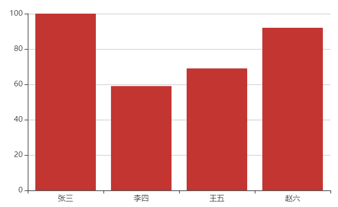
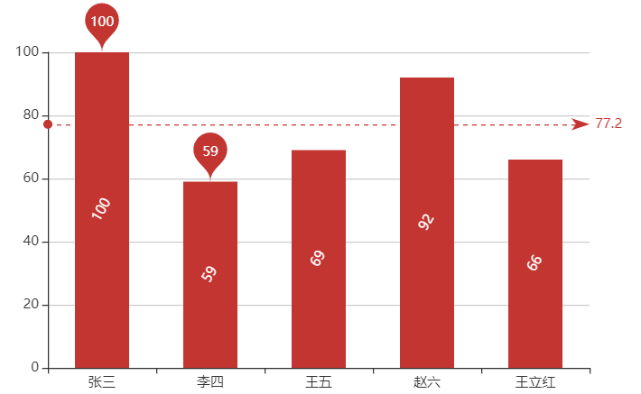
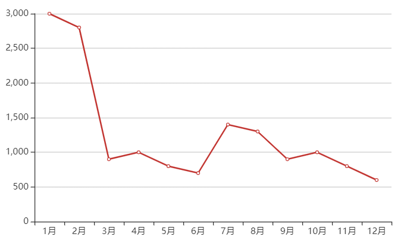
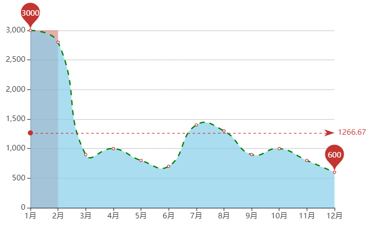
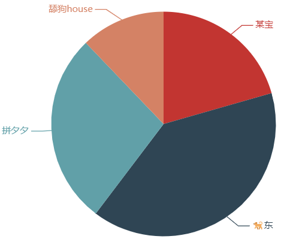
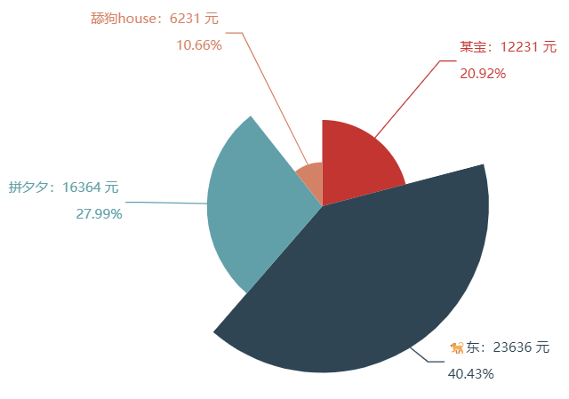

# 🔍 jQuery

# 🚪 入口函数

- JavaScript 入口函数不能重复
- jQuery 入口函数可多次调用
- JavaScript 入口函数需加载外部文件完成后才会执行
- jQuery 只需要加载完 DOM 元素即可

```javascript
window.onload = function () {
    xxx
}
window.onload = function () {
    yyy
}
```

```javascript
jQuery(document).ready(function () {
    xxx
})
jQuery(document).ready(function () {
    yyy
})
```

**jQuery 入口函数可简写为**

```javascript
$(function () {
    xxx
})
```
# jQuery 选择器

`$(selector)`

## 过滤选择器

- `$("选择器:eq(x)") ` 选择第x个元素
- `$("选择器:lt(x)") ` 选择小于x的元素
- `$("选择器:gt(x)") ` 选择大于x个元素
- `$("选择器:odd") ` 选择索引为奇数的元素
- `$("选择器:even") ` 选择索引为偶数的元素

## 筛选选择器

- `$(selector).children()` 选择被选元素的子代元素
  - `$(selector).children(".xxx")`
- `$(selector).find("yyy") ` 选择被选元素的后代为`yyy`的元素
- `$(selector).parent()` 选择被选元素的父亲元素
- `$(selector).parents()` 选择被选元素的祖先元素
- `$(selector).siblings()` 选择被选元素的兄弟元素
  - `$(selector).siblings(yyy)`
- `$(selector).next()` 选择被选元素的下一个兄弟元素
- `$(selector).nextAll()` 选择被选元素的下方所有兄弟元素
- `$(selector).prev()` 选择被选元素的上个兄弟元素
- `$(selector).prevAll()` 选择被选元素的所有上个兄弟元素
- `$(selector).eq(n)` 选择被选元素的第`n`个元素
- `$(selector).not('n选择器')` 选择被选元素的非`n`元素


# 样式设置

- `$(selector).css("属性名","属性值")` 设置被选元素的样式属性
  - `$(selector).css("属性名")` 获取被选元素的属性值

## 同时设置多个属性

```javascript
css({
    xxx: xxx,
    "yy-zz": "yy-zz"
})
```

- `rgb("属性名") 获取属性值`
  - 获取到的颜色为rgb样式


# 🔙 返回值

- jQuery 返回 jQuery 对象
- JavaScript 中返回 DOM 对象

# 动画

- 隐藏/显示
  - hide()
  - show()
  - toggle()
- 淡入/淡出
  - fadeIn()
  - fadeOut()
  - fadeToggle()
- stop() 停止动画或效果
- 自定义动画 异步  颜色效果无法生效
  - animate()

```javascript
$("button").click(function(){
    $("div").animate({
      left:'250px',
      opacity:'0.5',
      // fontSize: '18px',
      'font-size': '18px',
      width:'150px'
    });
});

$("button").click(function () {
    $("div").animate({
      left:'250px',
      opacity:'0.5',
      // fontSize: '18px',
      'font-size': '18px',
      width:'150px'
    });
},1000,function () {
  // 动画完成后
});
```

# 事件

## 绑定

`事件源.bind("事件类型 事件类型",事件处理程序)`

- `事件源.bind/on("事件类型",事件处理程序)`
- `事件源.bind/on({"事件类型":事件处理程序,"事件类型":事件处理程序})`


**bind()不支持未来新添加元素的事件设置**
on() 可以对元素进行动态绑定，新增元素也会有事件监听

`$(selector).delegate(childSelector,event,data,function)`

| 参数            | 描述                                                                               |
| --------------- | ---------------------------------------------------------------------------------- |
| _childSelector_ | 必需。规定要添加事件处理程序的一个或多个子元素。                                   |
| _event_         | 必需。规定添加到元素的一个或多个事件。<br>由空格分隔多个事件值。必须是有效的事件。 |
| _data_          | 可选。规定传递到函数的额外数据。                                                   |
| _function_      | 必需。规定当事件发生时运行的函数。                                                 |

delegate() 类似于on() 

## 遍历

```javascript
$.each("数组/对象", function (index, item) {
  xxx
})
$.each("对象", function (key, value) {
  xxx
})
```

# DOM 操作

## 尺寸修改

- `$(selector).width()`
- `$(selector).height()`
- `$(selector).outerWidth()`
  - 返回元素宽度(包括内边距和边框) offsetWidth
- `$(selector).outerHeight()`
  - 返回元素高度(包括内边距和边框) offsetHeight
  
## 添加

|          | 元素之前  | 元素之后 |
| -------- | --------- | -------- |
| **内部** | prepend() | append() |
| **外部** | before()  | after()  |

`$(selector).appendTo()` 剪切添加
`$(selector).prependTo()` 剪切添加

## 删除

- `remove()` 删除被选元素及其子元素 占位置
- `empty()` 从被选元素中删除子元素 不占位置

## 修改

- `html()` 设置或返回元素内容
  - innerHTML()
- `text()` 设置或返回元素文本
  - innerText()
- `val()` 设置或返回元素文本
- `attr()` 设置或返回元素属性
- `prop()` 设置或返回元素属性

`attr()` 可获取设置元素的自定属性 `prop()`不可行
`prop()` 控件属性时返回值为布尔类型 `attr()`为实际值

# ECharts

ECharts 是一个使用 JavaScript 实现的开源可视化库，兼容性强，底层依赖矢量图形库 ZRender，提供直观、交互丰富、可高度个性化定制的数据可视化图表。

# 快速上手

1. 引入 echarts.js 文件
2. 准备一个呈现图表的盒子
3. 初始化 echarts 实例对象
4. 准备配置项
5. 将配置项设置给 echarts 实例对象

ECharts 有 7 种常用图表：柱状图、折线图、散点图、饼图、地图、雷达图、仪表盘图

# 通用配置

通用配置指的是任何图表都能使用的配置。如下：

| 配置项  | 含义     |
| ------- | -------- |
| title   | 标题     |
| tooltip | 提示     |
| toolbox | 工具按钮 |
| legend  | 图例     |

## title 标题

```javascript
var option = {
  title: {
    text: '成绩展示',        // 标题名称
    textStyle: {
      color: 'red'          // 文字颜色
    },
    borderWidth: 2,         // 标题边框宽度
    borderColor: 'tomato',  // 边框颜色
    borderRadius: 10,       // 边框圆角
    left: 250,              // 标题位置
    top: 10
  }
}
```

## tooltip 提示框

```javascript
var option = {
  tooltip: {
    trigger: 'item',          // 触发类型
    triggerOn: 'mousemove',   // 触发条件
    formatter: '{b} : {c}'    // 格式化提示内容（字符串模板或回调函数）
  }
}
```

## toolbox 工具栏

内有 **导出图片、数据视图、动态类型切换、数据区域缩放、重置** 五个工具。

```javascript
var option = {
  toolbox: {
    feature: {
      saveAsImage: {},         // 导出图片
      dataView: {},            // 数据视图
      restore: {},             // 重置
      dataZoom: {},            // 区域缩放
      magicType: {
        type: ['bar', 'line']  // 图表类型切换
      }
    }
  },
}
```

## legend 图例

```javascript
var mCharts = echarts.init(document.querySelector('div'))
var xDataArr = ['张三', '李四', '王五', '赵六', '王立红']
var yDataArr1 = [100, 59, 69, 92, 66]
var yDataArr2 = [97, 49, 79, 88, 100]
var option = {
  legend: {
    data: ['数学分析', '高等代数']
  },
  series: [
    {
      name: '数学分析',
      type: 'bar',
      data: yDataArr1
    },
    {
      name: '高等代数',
      type: 'bar',
      data: yDataArr2
    }
  ]
}

```

# 柱状图



```javascript
// 3. 创建 echarts 实例对象
var mCharts = echarts.init(document.querySelector("div"));
// 4. 准备配置项
var option = {
  xAxis: {
    type: "category",
    data: ["张三", "李四", "王五", "赵六"],
  },
  yAxis: {
    type: "value",
  },
  series: [
    {
      name: "数学分析",
      type: "bar",
      data: [100, 59, 69, 92],
    },
  ],
};
// 5. 配置项设置给实例对象
mCharts.setOption(option);
```

## 相关配置

`xAxis`： 直角坐标系中 x 轴
`yAxis`： 直角坐标系中 y 轴
`series`：系列列表。每个系列通过 type 决定自己的图表类型

## 常见效果

- 标记：最大值\最小值、平均值 —— `markPoint`、`markLine`
- 显示：数值显示、柱宽度、横向柱状图 —— `label`、`barWidth`、`xy 对调`



```javascript
series: [
  {
    name: '数学分析',
    type: 'bar',
    markPoint: {
      data: [
        {
          type: 'max', name: '最大值'
        }, {
          type: 'min', name: '最小值'
        }
      ]
    },
    markLine: {
      data: [
        {
          type: 'average', name: '平均值'
        }
      ]
    },
    label: {
      show: true,
      rotate: 60,
      position: 'inside'
    },
    barWidth: '50%',
    data: yDataArr
  }
]
```

# 折线图



```javascript
var mCharts = echarts.init(document.querySelector('div'))
var xDataArr = ['1月', '2月', '3月', '4月', '5月', '6月', '7月', '8月', '9月', '10月', '11月', '12月']
var yDataArr = [3000, 2800, 900, 1000, 800, 700, 1400, 1300, 900, 1000, 800, 600]
var option = {
  xAxis: {
    type: 'category',
    data: xDataArr
  },
  yAxis: {
    type: 'value'
  },
  series: [
    {
      name: '康师傅',
      data: yDataArr,
      type: 'line' 		// 折线图
    }
  ]
}
mCharts.setOption(option)
```

## 常见效果

- 标记：最大值\最小值、平均值、标注空间 —— `markPoint`、`markLine`、`markArea`
- 线条控制：平滑、风格 —— `smooth`、`lineStye`
- 填充风格： `areaStyle`
- 紧挨边缘： `boundaryGap`
- 缩放：脱离 0 值的比率 —— `scale`
- 堆叠图： `stack`



```javascript
var option = {
  xAxis: {
    type: 'category',
    data: xDataArr,
    boundaryGap: false		// 紧挨边缘
  },
  yAxis: {
    type: 'value'
  },
  series: [
    {
      name: '康师傅',
      data: yDataArr,
      type: 'line', 		// 折线图
      markPoint: {
        data: [
          {
            type: 'max'
          },
          {
            type: 'min'
          }
        ]
      },
      markLine: {
        data: [
          {
            type: 'average'
          }
        ]
      },
      markArea: {
        data: [
          [
            {
              xAxis: '1月'
            }, 
            {
              xAxis: '2月'
            }
          ]
        ]
      },
      smooth: true,     	// 线条平滑
      lineStyle: {      	// 线条样式
        color: 'green',
        type: 'dashed'  	// dotted solid
      },
      areaStyle: {
        color: 'skyblue'
      }
    }
  ]
}
```

# 饼图



```javascript
var mCharts = echarts.init(document.querySelector("div"));
var pieData = [
  {
    name: "某宝",
    value: 12231,
  },
  {
    name: "啊东",
    value: 23636,
  },
  {
    name: "拼夕夕",
    value: 16364,
  },
  {
    name: "舔狗house",
    value: 7231,
  },
];
var option = {
  series: [
    {
      type: "pie",
      data: pieData,
    },
  ],
};
mCharts.setOption(option);
```

## 常见效果

- 显示数值 `label.formatter`
- 圆环
  设置两个半径 `radius` ，如 `radius: ['50%', '75%']`
- 南丁格尔图
  饼图各个区域半径随数值变化。`roseType: 'radius'` 。
- 选中效果
  选中模式 `selectedMode: 'single'`、 `selectedMode: 'multiple'`
  选中偏移量 `selectedOffset`



```javascript
var option = {
  series: [
    {
      type: 'pie',
      data: pieData,
      label: {
        show: true,                 // 显示文字
        formatter: (arg) => {		// 格式化文字内容
          return `${arg.name}：${arg.value} 元 \n\n${arg.percent}%`
        }
      },
      // radius: 100,               // 饼图半径
      // radius: ['50%', '75%']     // 圆环
      roseType: 'radius',           // 南丁格尔图
      selectedMode: 'single',       // 选中效果 (single,multiple)
      selectedOffset: 30,
    }
  ]
}

```