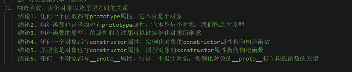

# OOP


Everything is object.

## 对象

对象是一个容器 封装了属性(property)和方法(method)

对象可理解为数据集  无序属性的集合

## 面向对象

将真实世界复杂关系抽象为一个个对象 然后由对象之间的分工与合作 完成对真实世界的模拟

### 秒懂


### 特征

- 封装
- 继承
- 多态

### 创建对象

- 字面量创建
- `new Object()` 创建
- 工厂模式
  > `function www(xxx,yyy,zzz){}` 创建
- 构造函数
  > function Xxx(){}

实例化对象有默认的 `constructor` 属性 指向构造函数

```javascript

var fn1 = function () {
}
console.log(fn1.constructor) //f Function( )

var fn2 = new Function('num1', 'num2', "return num1+num2")
console.log(fn2(10, 20)) //30
```

### 判断

`instanceof`

### 内存

#### 内存分配

变量定义 函数声明

#### 内存使用

变量运算 操作 函数调用

#### 内存销毁

浏览器关闭 函数调用完成

JavaScript 拥有自主销毁内存的机制


## 原型

### 作用

- 节省内存空间
- 实现数据共享(继承)

### 构造函数 实例对象 原型直接关系 

- 函数有 `prototype` 原型默认属性
  > `prototype` 本身为对象
- 构造函数 `prototype` 上的属性和方法可被实例化对象继承
- 对象有 `constructor` 属性，实例化对象的 `constructor` 属性指向构造函数
- `prototype` 也存在 `constructor` 属性  `constructor` 指向构造函数
  > `Xxx.prototype.constructor === Xxx`
- 对象有 `__proto__` 属性，实例化对象的 `constructor` 属性指向构造函数
  > `Xxx.__proto__ === Xxx.prototype`


  
将公共的属性和方法挂载到原型上

```javascript
function Person(name) {
    this.name = name;
    // this.age = age;
    // this.sex = sex;
}

Person.prototype.age = "xxx";
Person.prototype.sex = "yyy";

new Person("aaa");
new Person("bbb");
```

## 原型链

Object 原型中的 `__proto__` 指向 `null`

### 查找规则

[//]: # (先从构造函数 -> 原型链 -> undefined)

最终指向 `null`

### 改变this指向

`call()`

- 进行函数的调用
- 改变 `this` 的指向 
  > 没有参数时 `this` 指向 `window`
  > 一个参数时 `this` 指向 该参数

`apply()`

- 进行函数的调用
- 改变 `this` 的指向
  > 没有参数时 `this` 指向 `window`

`bind()`

- 不会进行函数的调用
- 改变 `this` 的指向
  > 没有参数时 `this` 指向 `window`

```javascript
var name = "xxx";
var obj = {
  name: "yyy",
  getName:function () {
    console.log(this.name)
  }
}
obj.apply();
obj.getName.apply();
obj.apply();

var obg = {
  name: "yyy",
  getName:function () {
    console.log(this.name)
  }.bind()
}
```